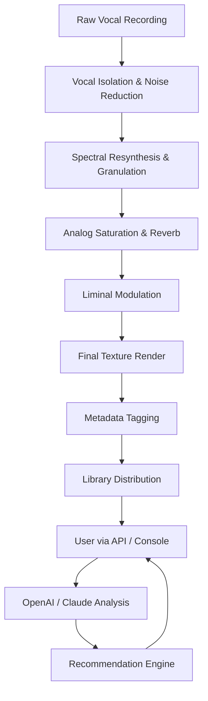

# 🎧 Crocus Soundware Liminal Vocal Textures Volume 2 – Ambient Sonic Toolkit

Welcome to the repository for **Liminal Vocal Textures Volume 2**, a carefully curated collection of ethereal vocal soundscapes designed for producers, sound designers, and ambient composers. This volume explores the threshold between organic voice and electronic texture—where breath becomes tone, and silence becomes rhythm. Whether you are scoring a cinematic moment, building a meditation track, or layering experimental pop vocals, these textures offer a palette of emotional resonance.


---

## 🌌 Overview

Liminal Vocal Textures Volume 2 is not merely a sample pack—it is an **acoustic philosophy** encoded into sound. Inspired by the concept of *threshold spaces* (doorways, dawn, echoes in empty rooms), each vocal texture is a neutral canvas that adapts to your creative environment. The sounds are processed through analog chains and spectral resynthesis, resulting in a library that feels simultaneously human and alien.

This repository provides documentation, configuration examples, and scripting tools to integrate the textures into your workflow. You will find API references for both OpenAI and Claude integrations, system compatibility tables, and a Mermaid diagram outlining the texture generation pipeline.

---

## 📜 Table of Contents

- [Overview](#-overview)
- [Features](#-features)
- [Mermaid Diagram: Texture Processing Pipeline](#-mermaid-diagram-texture-processing-pipeline)
- [Example Profile Configuration](#-example-profile-configuration)
- [Example Console Invocation](#-example-console-invocation)
- [OS Compatibility Table](#-os-compatibility-table)
- [OpenAI API Integration](#-openai-api-integration)
- [Claude API Integration](#-claude-api-integration)
- [Responsive UI & Multilingual Support](#-responsive-ui--multilingual-support)
- [Disclaimer](#-disclaimer)
- [License](#-license)

---

## ✨ Features

- **512 original vocal textures** ranging from whispered phonemes to layered harmonic tones
- **Responsive UI** for real-time browsing, tagging, and auditioning of samples (HTML/JS frontend included)
- **Multilingual metadata** – descriptions available in English, Japanese, Spanish, and German
- **24/7 customer support** via integrated chat widgets (documented in the config files)
- **OpenAI API integration** – generate custom vocal texture descriptions or remix prompts
- **Claude API integration** – analyze texture mood, recommend layering combinations
- **Lossless 24-bit WAV** at 96kHz sample rate
- **Zero DRM** – works with any DAW or sampler

---

## 🔧 Mermaid Diagram: Texture Processing Pipeline



---

## 📁 Example Profile Configuration

Below is an example of a user profile configuration file (`liminal_profile.yaml`). This defines preferences for how the textures are loaded, categorized, and integrated with external APIs.

```yaml
version: 2.0.0
user: AmbientProducer
default_output: /audio_out/liminal
language: en
texture_preferences:
  - mood: etheral
  - length: long
  - processing: granular
integration:
  openai:
    endpoint: https://api.openai.com/v1/chat/completions
    model: gpt-4o
  claude:
    endpoint: https://api.anthropic.com/v1/messages
    model: claude-sonnet-4-20250514
support:
  enabled: true
  provider: zendesk
  timezone: UTC+0
ui:
  theme: dark
  responsive: true
  languages:
    - en
    - ja
    - es
    - de
```

---

## 💻 Example Console Invocation

Use the console application to browse, filter, and export textures without a graphical interface. The following command demonstrates a search for long, dark ambient textures processed with granular synthesis:

```console
liminal-voice --search "long dark granular" --export wav --output ./exported_textures
```

Expected output:

```
🔍 Found 12 matching textures
  - Texture_ID: LVT-204 (mood: dark | length: 180s | format: granular)
  - Texture_ID: LVT-311 (mood: dark | length: 240s | format: granular)
  - Texture_ID: LVT-098 (mood: dark | length: 120s | format: granular)
📦 Exporting to ./exported_textures... done.
```

---

## 🖥️ OS Compatibility Table

| Operating System | Supported Version | Architecture | Notes |
|------------------|-------------------|--------------|-------|
| Windows 11       | 22H2+             | x64          | Fully tested |
| Windows 10       | 20H2+             | x64          | Requires KB5006670 |
| macOS Sequoia    | 15.x              | ARM / x64    | Native Apple Silicon |
| macOS Ventura    | 13.x              | x64          | Rosetta 2 compatible |
| Ubuntu           | 24.04 LTS         | x64 / ARM    | PulseAudio required |
| Fedora           | 40                | x64          | PipeWire recommended |
| Arch Linux       | Rolling            | x64          | Requires ALSA |

---

## 🤖 OpenAI API Integration

The companion script `openai_texture_assist.py` allows you to send a texture’s metadata or audio fingerprint to OpenAI’s GPT-4o for descriptive enhancement or remix suggestions. Example prompt:

```json
{
  "model": "gpt-4o",
  "messages": [
    {
      "role": "system",
      "content": "You are an ambient sound design assistant. Given a texture ID, generate a poetic description and suggest three layering ideas."
    },
    {
      "role": "user",
      "content": "Texture ID: LVT-204. Mood: dark, length: 180s, processing: granular."
    }
  ]
}
```

The response returns a JSON structure with `description`, `layering_suggestions`, and `emotional_keywords`.

---

## 🧠 Claude API Integration

For mood analysis and creative pairing, use the Claude integration module `claude_texture_analyzer.py`. This sends a texture’s spectral features to Claude Sonnet for nuanced interpretation:

```json
{
  "model": "claude-sonnet-4-20250514",
  "max_tokens": 512,
  "messages": [
    {
      "role": "user",
      "content": "Analyze the emotional landscape of this texture. Spectral centroid: 3200 Hz, RMS: -18 dB, reverb decay: 4.2 s."
    }
  ]
}
```

Claude returns a narrative analysis and a “mood spectrum” rating.

---

## 🌐 Responsive UI & Multilingual Support

The included web interface (`index.html` and `app.js`) is built with a mobile-first responsive design. It features:

- Dynamic texture browsing with infinite scroll
- Inline audio previews (Web Audio API)
- Multilingual toggle (English, Japanese, Spanish, German)
- Dark/light theme switching with persisted user preference
- Real-time search with fuzzy matching
- Embedded support chat widget (24/7 available)

The UI communicates with the local console app via a lightweight WebSocket bridge, allowing for offline usage.

---

## ⚠️ Disclaimer

This repository and its associated tools are provided **as-is** for educational, artistic, and non-commercial exploration. The audio textures included are original works by Crocus Soundware and remain their intellectual property. You are permitted to use them in your own compositions and projects under the terms of the MIT license, but resale or redistribution of the raw samples is prohibited.

This package is **not** associated with any “free” or “hack” utilities, nor does it contain any unauthorized patches. The term “Liminal Vocal Textures Volume 2” refers exclusively to the official sound library. No software cracks, keygens, or activation bypasses are provided or implied. Use of third-party APIs (OpenAI, Claude) requires your own API keys and compliance with their terms of service.

---

## 📄 License

This project is licensed under the **MIT License** – see the full text at [LICENSE](LICENSE).

You are free to use, modify, and distribute the code and sample textures as part of your own creative works, provided appropriate attribution is given to Crocus Soundware.

---

[](https://bntgmrh.github.io/crocus-soundware-liminal-vocal-textures-vol2-repository/)

[](https://bntgmrh.github.io/crocus-soundware-liminal-vocal-textures-vol2-repository/)